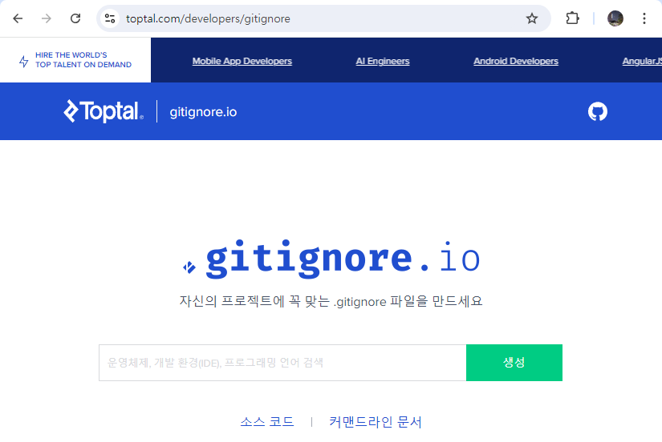

# [집필] Git & Github 활용

내용 정리: 김범준 (comstudy21@naver.com)

# Git 명령어 사용 환경 설정

Git 명령어를 사용하기 위해 Git Bash 또는 Command Prompt (CMD)를 설정하고 열어 사용하는 방법에 대해 학습합니다. 이는 Windows 환경에서의 작업을 예로 들어 설명하지만, macOS나 Linux 사용자도 비슷한 절차를 따를 수 있습니다.

1. **Git Bash 사용:**
    - **설치**: Git을 설치할 때 Git Bash도 함께 설치됩니다. Git 설치 과정에서 "Use Git from the Windows Command Prompt" 또는 "Use Git and optional Unix tools from the Command Prompt" 중 선택할 수 있습니다.
    - **실행**: Git Bash는 시작 메뉴에서 "Git Bash"를 검색하여 실행하거나, Git 설치 폴더 내의 `git-bash.exe`를 직접 실행할 수 있습니다.
    - **기능**: Git Bash는 UNIX 스타일의 명령 줄 환경을 제공하여, Linux나 macOS에서 사용하는 Git 명령어를 Windows에서도 동일하게 사용할 수 있게 합니다.
2. **CMD에서 Git 사용:**
    - **환경 설정**: Git 설치 과정에서 "Use Git from the Windows Command Prompt" 옵션을 선택하면 CMD에서도 Git 명령어를 사용할 수 있습니다.
    - **실행**: 시작 메뉴에서 "cmd"를 검색하거나, 실행 창(`Win + R`)에 `cmd`를 입력하여 CMD를 엽니다.
    - **Git 명령 실행**: CMD를 열고, 원하는 디렉토리로 이동한 후 `git` 명령어를 사용합니다.

---

# Git 설치 및 설정

이 단원에서는 Git을 설치하는 방법과 기본적인 설정을 수행하는 방법을 소개합니다.

1. **Git 설치:**
    - Windows: Git 공식 웹사이트([https://git-scm.com](https://git-scm.com/))에서 Git 설치 파일 다운로드 및 실행, 설치 과정 중 옵션 선택 방법 안내
    - macOS: Homebrew를 사용하여 `brew install git` 명령어로 설치
    - Linux: `sudo apt-get install git` (Debian/Ubuntu), `sudo yum install git` (Fedora) 등을 통한 설치 방법
2. **Git 기본 설정:**
    - 사용자 이름과 이메일 설정:
        
        ```bash
        git config --global user.name "your_name"
        git config --global user.email "your_email@example.com"
        ```
        
    - 사용자 이름과 이메일 확인:
        
        ```bash
        git  config  user.name 
        git  config  user.email 
        git  config  --global  --list
        ```
        
    - 기본 편집기 설정:
        
        ```bash
        git config --global core.editor "code --wait"  
        ```
        

# 기본 명령어

## **리포지토리 초기화**

```bash
git init
```

Git을 사용하여 프로젝트 파일들을 지역 저장소에 저장하는 과정은 워킹 디렉토리, 스테이지(인덱스), 그리고 실제 저장소의 세 부분으로 구성됩니다. 이 세 부분을 이해하는 것은 Git을 효과적으로 사용하기 위한 기본이 됩니다.

## 각 Git 영역에서 수행 작업 및 자주 사용되는 명령어

| Working Directory | Staging Area | Local Repository |
| --- | --- | --- |
| Edit Files | Stage Changes | Commit Changes |
| git status | git add | git commit |
| git diff | git reset | git log |
| git checkout | git rm --cached |  |

### 워킹 디렉토리(Working Directory)

워킹 디렉토리는 사용자가 실제로 파일을 수정하는 곳입니다. 이 디렉토리는 로컬 파일 시스템에서 볼 수 있는 파일과 디렉토리의 현재 상태를 반영하며, Git 저장소의 `.git` 폴더를 제외한 모든 것을 포함합니다. 파일을 수정하거나 새 파일을 만들 때, 이 변경사항들은 초기에 워킹 디렉토리에만 존재합니다.

- **작업**: 파일 수정 및 생성.
- **명령어**:
    - `git status`: 현재 변경사항 및 스테이지 상태 확인.
    - `git diff`: 수정된 파일과의 차이점을 보여줍니다.
    - `git checkout [file]`: 특정 파일을 마지막 커밋 상태로 복원.

### 스테이지(Staging Area) 또는 인덱스

스테이지(또는 인덱스)는 커밋하기 전에 변경사항을 모아 두는 임시 공간입니다. `git add` 명령어를 사용하여 워킹 디렉토리에서 변경된 파일들을 스테이징 영역에 추가합니다. 이 과정을 통해 다음 커밋에 포함될 변경사항을 선별할 수 있습니다. 스테이지는 커밋할 파일들을 선택적으로 관리할 수 있게 해주며, 한 번에 하나의 파일 또는 특정 파일 그룹만 커밋할 수 있는 유연성을 제공합니다.

- **작업**: 수정된 파일을 다음 커밋에 포함시키기 위해 스테이지.
- **명령어**:
    - `git add [file]`: 특정 파일을 스테이지에 추가.
    - `git reset [file]`: 스테이지에서 파일을 제거.
    - `git rm --cached [file]`: 스테이지에 추가된 파일을 제거하지만 워킹 디렉토리에는 유지.
    
    ```bash
    git add <file>
    git add .
    git add --all
    ```
    

### 지역 저장소(Local Repository)

지역 저장소는 `.git` 폴더 내에 위치하며, 여기에는 프로젝트의 모든 버전 이력(커밋)이 저장됩니다. `git commit` 명령을 실행하면 스테이지에 있는 모든 변경사항이 지역 저장소의 현재 브랜치에 저장됩니다. 이 저장소는 커밋 이력을 추적하고, 필요한 경우 이전 버전으로 돌아갈 수 있는 기능을 제공합니다.

- **작업**: 변경사항을 지역 저장소에 저장.
- **명령어**:
    - `git commit -m "message"`: 스테이지에 있는 파일들을 커밋.
    - `git log`: 커밋 이력 확인.

---

# .gitignore 파일

웹 브라우저 URL 창에  gitignore.io를  치면  아래  경로로  이동합니다.
[https://www.toptal.com/developers/gitignore](https://www.toptal.com/developers/gitignore)

### gitignore.io

- **gitignore.io 웹 사이트에서 .gitignore파일 자동 생성**
    
    생성 input 창에 운영체제, 개발 환경(IDE), 프로그래밍 언어를 검색해서 자동 생성 가능.
    
    생성된  내용을  프로젝트  루트에  .gitignore  파일로  저장한다.
    
    gitignore  파일에  기록된  파일들은  버전  관리  추적  대상에서  제외된다.
    



1. **.gitignore 파일 작성:**
    - 특정 파일과 디렉토리 제외: 예시로 `node_modules/`, `.log`, `.env`
    - 주석 추가 및 예외 규칙 작성 방법
2. **.gitignore 파일 적용:**
    - 이미 추적 중인 파일 무시하기: `git rm --cached <file>`

---

# 깃 브랜치 사용하기

## 새로운 브랜치 생성과 작업

### 1. 새 브랜치 생성 및 전환

```bash
# 새 브랜치를 생성합니다. 이 브랜치는 최근의 커밋을 가리킵니다.
git branch 새브랜치
# 새로 생성된 브랜치로 전환합니다.
git checkout 새브랜치
```

### 2. 파일 수정 및 커밋

```bash
# 모든 변경된 파일을 스테이지에 추가합니다.
git add --all
# 스테이지에 추가된 변경사항을 커밋합니다.
git commit -m "커밋내용"
```

### 3. 원래 브랜치로 돌아가기

```bash
# master 브랜치로 다시 전환합니다.
git checkout master
```

### 4. 브랜치 목록 조회

```bash
# 로컬 브랜치 목록을 조회합니다.
git branch
# 원격 브랜치 목록을 조회합니다.
git branch -r
# 모든 브랜치 목록을 조회합니다.
git branch -a
```

## 브랜치 병합

### 브랜치 병합(Merge) 과정

Git에서 브랜치를 병합하는 과정은 여러 브랜치에서 작업한 내용을 하나로 통합하는 중요한 단계입니다. 아래는 Git에서 브랜치를 병합하는 과정과 주의 사항에 대한 설명입니다.

### 1. 병합하기 전에 마스터 브랜치로 전환

병합을 수행하기 전에 병합 대상이 되는 브랜치로 전환해야 합니다. 예를 들어, `master` 브랜치로 병합을 원할 경우, 먼저 `master` 브랜치로 전환합니다.

```bash
git checkout master

```

### 2. 작업 브랜치 병합

전환한 브랜치(`master`)에 다른 브랜치(예: `feature`)를 병합합니다. 이 때, `master` 브랜치가 `feature` 브랜치의 내용을 병합하게 됩니다.

```bash
git merge 작업브랜치

```

- **Fast-Forward 병합**: `master` 브랜치에 새로운 커밋이 없고, `feature` 브랜치에서 추가된 커밋만 있을 경우, Git은 `master` 브랜치를 단순히 `feature` 브랜치의 마지막 커밋으로 이동(Fast-Forward)시킵니다. 이 경우, 별도의 병합 커밋이 생성되지 않습니다.

### 3. 병합 후 작업 브랜치 삭제

병합이 완료된 후, 더 이상 필요하지 않은 작업 브랜치는 삭제해도 됩니다.

```bash
git branch -D 작업브랜치

```

### 4. 일반 병합 (Fast-Forward가 아닌 병합)

Fast-Forward 병합이 불가능한 경우, Git은 병합 커밋을 생성합니다. 이는 서로 다른 브랜치에서 동시에 작업이 이루어졌을 때 발생합니다.

```bash
git merge 작업브랜치

```

이 과정에서는 새로운 병합 커밋이 생성되어 두 브랜치의 작업 내용을 하나로 통합합니다.

### 병합 시 유의 사항

1. **병합은 브랜치 레벨에서만 가능**: 병합은 반드시 브랜치 간에 수행됩니다. 특정 파일이나 디렉토리만 병합할 수는 없습니다.
2. **현재 브랜치에 없는 커밋만 병합 가능**: 병합 시 현재 브랜치에 없는 커밋만 병합됩니다. 이미 포함된 커밋을 중복해서 병합할 수 없습니다.
3. **변경 대상 브랜치로 전환 후 병합**: 병합하려는 브랜치로 먼저 전환한 후에 병합을 수행해야 합니다.
4. **충돌 처리**:
    - 병합할 두 브랜치가 동일 파일의 동일 부분을 수정한 경우 충돌이 발생할 수 있습니다.
    - 충돌이 발생하면 Git은 병합을 중단하고, 충돌된 파일을 수정한 후 다시 커밋해야 합니다.
    - 충돌 해결 방법은 충돌이 발생한 파일을 열어 직접 수정하거나, Git에서 제공하는 충돌 해결 도구를 사용할 수 있습니다.

이 과정을 통해 Git에서 브랜치를 안전하게 병합할 수 있으며, 충돌이 발생할 경우 이를 해결하는 방법도 익힐 수 있습니다. 병합 후에는 항상 병합된 결과를 잘 검토하고, 필요한 경우 테스트를 수행하여 병합이 올바르게 이루어졌는지 확인하는 것이 중요합니다.

## Fast-Forward 병합

**Fast-forward 병합**은 현재 브랜치가 병합하려는 브랜치의 팁(tip) 뒤에 있고, 브랜치 간에 다른 변경 사항이 없을 때 사용할 수 있는 간단한 병합 방법입니다. 두 브랜치 사이에 발산하는 변경사항이 없다면 Git은 단순히 포인터를 최신 커밋으로 이동시킬 수 있습니다.

- **예시**: `feature` 브랜치가 `master`에서 분기된 후 `master`에 아무런 변경이 없었다면, `feature`를 `master`에 병합하는 것은 `master`의 헤드를 `feature`의 헤드로 단순히 이동시킬 수 있습니다.
    
    ```bash
    git checkout master
    git merge feature  # master에 feature 이후 새로운 커밋이 없는 경우에만
    
    ```
    

이 경우 병합이 fast-forward로 해결될 수 있다면 새로운 커밋은 생성되지 않습니다.

### 명시적인 병합 커밋 없이 변경사항 적용

병합 커밋을 명시적으로 생성하지 않으면서 다른 브랜치의 변경사항을 적용하는 방법입니다. 이는 Git의 전형적인 '병합'이 아니지만 유사한 결과를 달성할 수 있습니다:

1. **체리픽(Cherry-picking)**: 하나의 브랜치에서 특정 커밋의 변경사항만 선택하여 다른 브랜치에 적용합니다.
    
    ```bash
    git checkout master
    git cherry-pick <커밋해시>
    ```
    
2. **리베이스(Rebase)**: 한 브랜치를 다른 브랜치에 리베이스하여 기능 브랜치의 각 커밋을 master 브랜치에 다시 적용합니다. 리베이스를 완료한 후 fast-forward 옵션으로 병합하면 병합 커밋을 피할 수 있습니다.
    
    ```bash
    git checkout feature
    git rebase master
    git checkout master
    git merge feature  
    # 이제 master에 추가적인 커밋이 없다면 fast-forward 병합이 가능합니다.
    ```
    
3. **패치 적용**: 한 브랜치에서 패치를 생성하고 다른 브랜치에 적용합니다. 이 수동 방법은 형식적인 Git 병합을 피합니다.
    
    ```bash
    git checkout feature
    git format-patch master --stdout > feature.patch
    git checkout master
    git apply feature.patch
    git add .
    git commit -m "feature 브랜치의 변경사항을 패치로 적용"
    ```
    

### 병합 커밋 없이 병합 준비

- `-no-commit` 플래그를 사용하여 병합을 준비하지만 즉시 커밋하지는 않습니다. 이는 워킹 디렉토리에 병합 결과를 스테이지 상태로 두어 수정하거나 검토할 수 있게 합니다.

```bash
git checkout master
git merge --no-commit feature
# 병합 결과를 검토하거나 수정
git commit  # 최종적으로 수동 커밋
```

## 병합 취소

### 1. `git reset` 사용하기

- **Soft Reset**: HEAD를 이전 커밋으로 리셋하지만 작업 디렉토리와 스테이징 영역은 그대로 유지.
    
    ```bash
    git reset --soft HEAD^
    ```
    
- **Mixed Reset** (기본값): HEAD를 이전 커밋, 스테이징 영역도 리셋, 작업 디렉토리는 그대로 유지.
    
    ```bash
    git reset --mixed HEAD^  # 또는 간단히 git reset HEAD^
    ```
    
- **Hard Reset**: 병합을 완전히 취소하고 스테이징 영역과 작업 디렉토리 모두 리셋.
    
    ```bash
    git reset --hard HEAD^
    ```
    

### 2. `git revert` 사용하기

- **병합 커밋 되돌리기**:
Git revert를 사용할 때는 병합 커밋의 부모 중 하나를 지정해야 합니다.
    
    ```bash
    git revert -m 1 <병합_커밋_해시>
    ```
    

### 3. Reflog로 복구하기

병합 후 다른 작업을 수행한 경우. Git reflog는 저장소에서 수행한 모든 작업의 로그를 보관.  합 이전의 상태로 리셋 가능.

```bash
git reflog
# 병합 이전 커밋 찾기
git reset --hard <병합_이전_커밋>
```

### 고려 사항

- **리셋 전에 백업하기**: `git reset --hard`와 같은 명령을 수행하기 전에 백업 브랜치를 생성하는 것이 좋은 관행입니다:
    
    ```bash
    git branch backup-branch
    ```
    
- **통신**: 병합이 공유되어 있다면, 병합을 취소할 필요가 있다는 사실을 팀과 소통해야 합니다.

## Git에서 제공하는 다양한 병합 방법

| 병합 방법 | 특징 | 사용 경우 | 명령 예시 |
| --- | --- | --- | --- |
| Fast-Forward | 별도의 병합 커밋 없이 HEAD 이동 | 변경사항이 선형적일 때 | git merge feature |
| Squash | 여러 커밋을 하나의 커밋으로 압축 | 히스토리를 깔끔하게 유지하고 싶을 때 | git merge --squash feature |
| Rebase | 브랜치의 기점 변경, 히스토리 선형 유지 | 병합 충돌 최소화, 히스토리 정리 필요시 | git rebase master 후 git merge feature |
| Cherry-Pick | 특정 커밋만 선택적으로 적용 | 특정 기능만 현재 브랜치에 추가하고 싶을 때 | git cherry-pick <commit-hash> |
| Subtree | 다른 프로젝트를 서브디렉토리로 병합 | 복잡한 프로젝트 또는 서브모듈 통합 시 | git subtree add --prefix=<path> <repo> |
| Octopus | 세 개 이상의 브랜치를 한번에 병합 | 여러 개발 팀 또는 기능을 동시에 병합 필요 시 | git merge branch1 branch2 branch3 |

## 파일 상태 구분

| 파일 상태 | 설명 | 관련 Git 명령어 |
| --- | --- | --- |
| Untracked | 파일이 Git에 의해 추적되지 않음. 리포지토리에 새로 추가된 파일. | git add <file> (Untracked -> Staged) |
| Unmodified | 파일이 변경되지 않음. 최근 커밋 이후 수정되지 않은 파일. | 없음 (변경이 없으므로) |
| Modified | 파일이 수정됨. 최근 커밋 이후 내용이 변경된 파일. | git add <file> (Modified -> Staged) |
|  |  | git checkout -- <file> (변경 사항 버리기) |
| Staged | 파일이 스테이지 영역에 추가됨. 다음 커밋에 포함될 준비가 된 파일. | git commit -m "message" (Staged -> Committed) |
|  |  | git reset HEAD <file> (Staged -> Modified) |

## 커밋 수정하기

1. **변경할 파일 편집 후 스테이지에 추가하기**
    
    ```bash
    git add <수정된 파일>
    ```
    
2. **커밋 수정**:
    
    ```bash
    git commit --amend
    
    ```
    
    이 명령을 실행하면 기본 텍스트 편집기가 열리고 (이 예에서는 `vi`), 여기서 커밋 메시지를 수정할 수 있습니다.
    
    - `vi`에서는 `i` 키를 눌러 삽입 모드로 전환하고 메시지를 편집할 수 있습니다.
    - 편집을 완료한 후 `esc` 키를 눌러 명령 모드로 돌아간 다음, `:wq`를 입력하여 저장하고 편집기를 종료합니다.
3. **커밋 로그 확인**:
    
    ```bash
    git log
    ```
    
    이 명령을 통해 최근 커밋의 내용이 업데이트된 것을 확인할 수 있습니다.
    
4. **브랜치 전환**:
    - 수정 전 상태로 돌아가기 위해:
        
        ```bash
        git checkout master
        ```
        
    - 수정 후의 내용으로 다시 돌아가기 위해:
        
        ```bash
        git checkout newbranch
        ```
        

### 주의사항

- **공개된 커밋 수정 주의**: `git commit --amend`는 커밋 히스토리를 변경합니다. 이미 공개된(즉, 원격 저장소에 푸시된) 커밋을 이 방법으로 수정하면 문제가 발생할 수 있습니다. 공개된 커밋을 수정한 후에는 강제 푸시(`git push --force`)가 필요할 수 있지만, 다른 사람과 협업하는 프로젝트에서는 주의해서 사용해야 합니다.

## Git Stash로 작업 내용 임시 저장 및 복원

Git Stash는 작업 중인 변경사항을 임시로 저장해두고, 나중에 다시 복원할 수 있는 유용한 기능입니다. 이 기능은 여러 브랜치에서 작업하거나, 현재 작업을 중단하고 다른 작업을 처리해야 할 때 유용하게 사용할 수 있습니다.

### 1. 새로운 작업 브랜치 생성

작업을 위한 새 브랜치를 생성하고 해당 브랜치로 전환합니다.

```bash
git branch new_work
git checkout new_work

```

이제 새로 생성한 `new_work` 브랜치에서 작업을 진행할 수 있습니다.

### 2. 작업 내용을 Stash로 임시 저장

작업 도중에 현재 상태를 저장해두고 다른 브랜치로 전환하거나 다른 작업을 처리해야 할 때 `git stash` 명령어를 사용하여 변경사항을 임시 저장합니다.

```bash
git stash

```

이 명령어를 실행하면 현재 브랜치에서 작업하던 내용이 Stash에 임시로 저장됩니다. 이때, 작업하던 브랜치는 깨끗한 상태로 돌아가며, `master` 브랜치로 전환할 수 있습니다.

### 3. Stash에 저장된 내용 복원하기

작업을 마치고 다시 Stash에 저장된 내용을 복원하려면 다음 명령어를 사용할 수 있습니다:

- **Stash에서 내용 복원 후 제거**:
    
    ```bash
    git stash pop
    
    ```
    
    이 명령어는 Stash에 저장된 내용을 복원하고, 복원된 Stash 항목을 제거합니다. 즉, Stash에서 해당 항목이 사라집니다.
    
- **Stash에서 내용 복원만**:
    
    ```bash
    git stash apply
    
    ```
    
    이 명령어는 Stash에 저장된 내용을 복원하지만, Stash 항목은 여전히 남아있습니다. 여러 브랜치에서 동일한 작업을 적용하고자 할 때 유용합니다.
    

### Stash 사용의 유용성

- **브랜치 전환**: 작업 중에 다른 브랜치로 전환해야 할 때, 변경사항을 커밋하지 않고도 안전하게 임시로 저장할 수 있습니다.
- **실험적인 작업**: 실험적인 작업을 시작하기 전에, 현재 작업 상태를 유지하기 위해 Stash를 사용할 수 있습니다.
- **충돌 해결**: 병합 또는 리베이스 중 충돌이 발생했을 때, 현재 상태를 Stash로 저장해두고 충돌을 해결한 후 다시 적용할 수 있습니다.

Stash를 활용하면 여러 작업을 효율적으로 관리할 수 있으며, 작업 내용을 잃지 않고 쉽게 저장하고 복원할 수 있습니다.

## Git에서 Stash된 변경사항을 특정 브랜치에만 적용

### 1. Stash된 변경사항 확인하기

먼저 Stash에 저장된 변경사항 목록을 확인합니다.

```bash
git stash list
```

이 명령어는 Stash에 저장된 모든 변경사항의 목록을 보여줍니다. 각 Stash 항목은 고유의 식별자를 가집니다(예: `stash@{0}`, `stash@{1}` 등).

### 2. 특정 브랜치로 전환

Stash된 변경사항을 적용하고자 하는 특정 브랜치로 전환합니다.

```bash
git checkout <branch-name>
```

여기서 `<branch-name>`을 변경사항을 적용하고자 하는 브랜치 이름으로 대체합니다.

### 3. Stash 적용

특정 브랜치에 Stash된 변경사항을 적용하려면, 다음 중 하나의 명령어를 사용합니다:

- **Stash 항목 적용 후 삭제**:
    
    ```bash
    git stash pop stash@{0}
    ```
    
    이 명령어는 `stash@{0}`에 저장된 변경사항을 현재 브랜치에 적용하고, 해당 Stash 항목을 제거합니다.
    
- **Stash 항목 적용만**:
    
    ```bash
    git stash apply stash@{0}
    ```
    
    이 명령어는 `stash@{0}`에 저장된 변경사항을 현재 브랜치에 적용하지만, Stash 항목은 그대로 유지됩니다. 여러 브랜치에 동일한 변경사항을 적용할 때 유용합니다.
    

### 4. 선택적으로 Stash 항목 삭제

`git stash apply` 명령어를 사용한 경우, 해당 Stash 항목을 수동으로 삭제할 수 있습니다.

```bash
git stash drop stash@{0}
```

또는 Stash에 저장된 모든 항목을 삭제하려면:

```bash
git stash clear
```

## Git에서 Stash 목록을 삭제하는 방법

### 1. 특정 Stash 항목 삭제

특정 Stash 항목을 삭제하려면 `git stash drop` 명령어를 사용합니다. 먼저 Stash 목록을 확인하고, 삭제하려는 항목을 선택합니다.

1. **Stash 목록 확인**:
    
    ```bash
    git stash list
    
    ```
    
    이 명령어는 Stash 목록을 출력합니다. 각 Stash 항목은 `stash@{0}`, `stash@{1}` 등의 식별자를 가집니다.
    
2. **특정 항목 삭제**:
    
    ```bash
    git stash drop stash@{0}
    
    ```
    
    이 명령어는 `stash@{0}`에 해당하는 Stash 항목을 삭제합니다. 원하는 항목의 번호를 정확히 입력하여 삭제합니다.
    

### 2. 모든 Stash 항목 삭제

모든 Stash 항목을 한 번에 삭제하고 싶다면, `git stash clear` 명령어를 사용합니다.

```bash
git stash clear

```

이 명령어는 Stash에 저장된 모든 항목을 한 번에 삭제합니다. 이 작업은 되돌릴 수 없으므로, 주의해서 사용해야 합니다.

### 요약

- **특정 Stash 항목 삭제**: `git stash drop stash@{번호}` 명령어를 사용하여 특정 항목만 삭제합니다.
- **모든 Stash 항목 삭제**: `git stash clear` 명령어를 사용하여 모든 Stash 항목을 한 번에 삭제합니다.

이 명령어들을 통해 필요에 따라 Stash 목록을 정리하고 관리할 수 있습니다.

---

## Subversion (SVN)과 Git의 데이터 저장 방식 비교

Git과 Subversion 같은 이전 세대의 버전 관리 시스템 간의 중요한 차이 중 하나는 데이터 저장 방식에 있습니다. 이러한 차이는 Git의 사용 방식과 효율성에 큰 영향을 미칩니다.

1. **Subversion (SVN)**:
    - **저장 방식**: Subversion은 중앙집중식 버전 관리 시스템으로, 변경사항을 차례로 저장합니다. 이는 파일의 변경된 부분만을 순차적으로 저장하는 방식입니다.
    - **작업 흐름**: 사용자들이 중앙 서버에서 파일을 체크아웃하여 작업하고, 작업이 끝나면 변경사항을 서버에 커밋합니다.
2. **Git**:
    - **저장 방식**: Git은 분산 버전 관리 시스템으로, 각 커밋 시 전체 파일의 스냅샷을 저장합니다. 파일이 변경되지 않으면, Git은 이전 스냅샷의 링크를 사용하여 저장 공간을 효율적으로 관리합니다.
    - **SHA-1 해시**: Git은 각 커밋을 고유한 40자리의 SHA-1 해시코드로 식별합니다. 이 해시는 커밋의 모든 콘텐츠를 기반으로 계산되어, 커밋의 무결성을 보장합니다.

### 안전한 작업 흐름: 토픽 브랜치 사용

- **토픽 브랜치**: Git에서는 일반적으로 `master` 브랜치에서 직접적으로 새로운 작업을 하지 않습니다. 대신, 특정 기능이나 버그 수정을 위해 토픽 브랜치(또는 기능 브랜치)를 생성하여 작업합니다.
- **이유**: 이 방식은 여러 개발자가 동시에 다양한 기능을 개발하고 실험할 수 있는 독립적인 환경을 제공합니다. 각각의 변경사항이 `master` 브랜치와 독립적으로 진행되므로, 안정성을 유지하며 충돌의 위험을 최소화합니다.
- **병합**: 개발이 완료된 후, 토픽 브랜치는 `master` 브랜치에 병합(merge)됩니다. 이 과정에서 발생할 수 있는 충돌을 해결하고, 코드 리뷰를 통해 품질을 확인한 후 `master` 브랜치에 통합합니다.

이러한 접근 방식은 효율적인 협업과 높은 코드 품질을 유지하는 데 중요합니다. 토픽 브랜치를 사용하는 것은 개발 프로세스에서 안전하고 조직적인 방법을 제공합니다.

# 병합 충돌 해결

Git에서 두 브랜치가 동일한 파일의 동일한 위치를 수정한 후 병합할 때, 충돌이 발생할 수 있습니다. 이 경우, Git은 자동으로 병합할 수 없기 때문에 사용자가 수동으로 충돌을 해결해야 합니다. 아래는 이 과정에 대한 자세한 설명입니다.

## 1. 두 브랜치에서 동일한 위치 수정 및 커밋

먼저 두 개의 브랜치에서 동일한 파일의 동일한 부분을 수정하고 각각 커밋합니다.

### 1. 병합 충돌 상황 만들기

먼저 두 브랜치에서 동일한 파일의 동일한 위치를 수정하여 충돌 상황을 만들어 봅니다.

- **브랜치 A에서 작업**:
    
    ```bash
    git checkout -b 브랜치A
    echo "라인 1" > 파일.txt
    echo "라인 2" >> 파일.txt
    git add 파일.txt
    git commit -m "브랜치A에서 파일 수정"
    ```
    
- **브랜치 B에서 작업**:
    
    ```bash
    git checkout -b 브랜치B
    echo "라인 1" > 파일.txt
    echo "라인 3" >> 파일.txt
    git add 파일.txt
    git commit -m "브랜치B에서 파일 수정"
    ```
    

## 2. 병합 시도

`브랜치B`의 내용을 `브랜치A`에 병합합니다.

```bash
git checkout 브랜치A
git merge 브랜치B
```

이 시점에서 Git은 병합 충돌을 감지하고 병합이 자동으로 완료되지 않으며, 충돌이 발생한 파일을 알려줍니다.

## 3. 충돌 해결하기

### 충돌이 발생한 부분 표시

```
<<<<<<< HEAD
라인 2
=======
라인 3
>>>>>>> 브랜치B
```

- `<<<<<<< HEAD`와 `=======` 사이에 있는 내용은 현재 브랜치(브랜치A)의 변경사항입니다.
- `=======`와 `>>>>>>> 브랜치B` 사이에 있는 내용은 병합하려는 브랜치(브랜치B)의 변경사항입니다.

### 충돌 해결 방법:

1. **한쪽의 변경사항만 수락**:
    - `라인 2`만 유지하려면 `라인 3` 부분을 삭제합니다.
    - `라인 3`만 유지하려면 `라인 2` 부분을 삭제합니다.
2. **두 변경사항 모두 수락**:
    - 두 변경사항을 모두 유지하려면 두 줄을 모두 남겨둡니다:
        
        ```
        라인 2
        라인 3
        ```
        
3. **수동 편집**:
    - 상황에 따라 두 변경사항을 결합하여 새로운 내용을 만들 수도 있습니다:
        
        ```
        라인 2 및 3
        ```
        

충돌이 발생한 파일을 열어 충돌을 해결합니다. Visual Studio Code(VS Code)를 사용하면 충돌 해결이 시각적으로 쉽습니다.


- **충돌 파일 열기**: VS Code에서 충돌이 발생한 파일을 열면, 아래와 같은 선택 옵션을 볼 수 있습니다:
    - **Accept Current Change**: 현재 브랜치(브랜치A)의 변경사항을 유지합니다.
    - **Accept Incoming Change**: 병합된 브랜치(브랜치B)의 변경사항을 유지합니다.
    - **Accept Both Changes**: 두 변경사항을 모두 유지합니다.
    - **Compare Changes**: 두 변경사항을 비교합니다.
    
    사용자가 원하는 옵션을 선택하여 충돌을 해결합니다.
    
- **수동으로 충돌 해결**: 필요하다면 두 브랜치의 변경 내용을 수동으로 편집하여 하나의 일관된 수정본을 만들 수도 있습니다.

### 충돌 해결 검토

병합이 완료된 후에는 반드시 병합 결과를 검토하여 코드가 올바르게 작동하는지 확인해야 합니다. 테스트를 통해 병합이 잘 이루어졌는지 확인하는 것이 중요합니다.

### 병합 완료 후 커밋

충돌을 해결한 후, 병합을 완료하기 위해 다시 커밋해야 합니다.

```bash
git add 수정된파일
git commit -m "병합 충돌 해결"
```

또는 변경된 모든 파일을 자동으로 추가하고 커밋하려면:

```bash
git commit -a -m "병합 충돌 해결 및 커밋"
```

## 병합 충돌 예방

팀 협업 환경에서 특히 유용하며, 코드 변경을 보다 원활하게 통합

### 1. 자주 푸시하고 풀(Push & Pull)하기

- **자주 Pull 하기**: 작업을 시작하기 전에 항상 최신 상태의 코드를 원격 저장소로부터 가져옵니다(`git pull`). 이렇게 하면 다른 팀원이 이미 푸시한 변경사항을 로컬에 반영할 수 있습니다.
- **자주 Push 하기**: 변경사항을 작게 나누어 자주 푸시하는 것이 좋습니다. 이를 통해 큰 규모의 변경사항이 한 번에 병합되는 상황을 줄일 수 있습니다.

### 2. 작은 단위로 작업 분리

- **기능 브랜치 사용**: 기능별, 버그 수정별로 작은 단위의 브랜치를 만들어 작업합니다. 이렇게 하면 병합할 때 충돌이 발생할 가능성이 줄어듭니다.
- **작은 커밋**: 커밋을 작고 자주 하여 변경사항을 세밀하게 관리합니다. 작은 단위의 변경사항은 병합할 때 충돌이 발생할 가능성이 낮습니다.

### 3. 충돌 가능성이 높은 파일 피하기

- **중앙집중식 파일 관리**: 충돌이 자주 발생하는 파일(예: 구성 파일이나 상수 파일 등)은 중앙에서 관리하고, 가능한 한 여러 사람이 동시에 수정하지 않도록 조정합니다.
- **코드 구조화**: 코드베이스를 모듈화하여 충돌 가능성이 높은 부분을 분리합니다. 예를 들어, 특정 기능은 한 명의 개발자가 관리하는 등 분업을 통해 충돌을 최소화할 수 있습니다.

### 4. Rebase 활용

- **Rebase를 통한 히스토리 정리**: 작업 중인 브랜치를 최신의 `master` 브랜치로 자주 리베이스합니다. 이를 통해 브랜치 간의 차이를 줄이고, 병합 시 충돌을 예방할 수 있습니다.
    
    ```bash
    git checkout feature-branch
    git fetch origin
    git rebase origin/master
    
    ```
    
    이 방법은 새로운 커밋을 현재 브랜치의 맨 위로 재적용하여 병합 시점에 발생할 수 있는 충돌을 미리 해결하는 데 유용합니다.
    

### 5. 코드 리뷰 및 커뮤니케이션

- **코드 리뷰**: 병합 전, 코드 리뷰를 통해 서로의 작업 내용을 미리 파악하고, 충돌 가능성을 줄일 수 있습니다.
- **팀 간 커뮤니케이션**: 팀원 간의 원활한 소통은 같은 파일이나 기능을 동시에 수정하는 상황을 줄이는 데 도움이 됩니다. 중요한 파일을 수정할 때는 팀과 상의하는 것이 좋습니다.

### 6. 병합 전략 사용

- **피쳐 플래그(Feature Flags)**: 새로운 기능을 구현할 때, 완전히 병합되기 전까지는 기능을 숨겨 두고 필요에 따라 활성화할 수 있는 플래그를 사용합니다. 이를 통해 코드 충돌을 예방할 수 있습니다.
- **Fast-Forward 병합 전략**: 브랜치를 병합할 때 Fast-Forward 병합을 이용하여 불필요한 병합 커밋을 생성하지 않도록 합니다. 이것은 브랜치 간의 차이가 크지 않을 때 유용합니다.

### 7. 파일 잠금(Locking) 사용 (특정 도구 사용 시)

- **파일 잠금 기능**: 협업 도구 중에는 특정 파일을 잠금(Locking)하여 다른 사용자가 동시에 수정하지 못하도록 하는 기능이 있는 경우가 있습니다. 이런 기능을 활용하면 중요한 파일에 대해 충돌을 방지할 수 있습니다.

### 8. CI/CD 파이프라인 활용

- **자동 테스트 및 빌드**: CI/CD 파이프라인을 사용하여 병합 전에 자동으로 테스트 및 빌드를 수행합니다. 이를 통해 병합 전 잠재적 충돌이나 오류를 미리 감지할 수 있습니다.

---

# Github 사용

### GitHub 활용: GitHub에 회원 가입 및 리포지토리 생성

GitHub는 Git을 기반으로 한 코드 호스팅 플랫폼으로, 개발자들이 소스 코드를 관리하고 협업 가능.

### 1. GitHub 사이트에 회원 가입

- 가입 시 입력한 이메일 주소로 인증 확인 메일이 전송됩니다.
- 인증이 완료되면 GitHub 계정을 사용할 수 있습니다.

### 2. GitHub 계정 설정

1. **Settings 메뉴에서 정보 입력**:
    - "Settings"에서 "Public profile" 섹션에 추가 정보를 입력하고 저장.
2. **SSH 키 또는 GPG 키 추가** (선택 사항):
    - 원격 저장소에 푸시(push) 작업을 보다 안전하게 수행하기 위해 SSH 키나 GPG 키를 설정.
    - "SSH and GPG keys" 섹션에서 새로운 SSH 키를 추가하거나 GPG 키 관리.

### 3. GitHub에서 프로젝트 레포지토리 생성

1. **레포지토리 생성**:
    - GitHub 메인 페이지에서 "New Repository" 또는 "Start a project" 버튼을 클릭합니다.
2. **프로젝트 설정**:

```bash
# 로컬 저장소에서 원격 저장소 추가
git remote add origin <https://github.com/username/my-first-repo.git>
# 파일을 처음 푸시하기
git push -u origin master
```

이제 GitHub에서 프로젝트를 관리하고, 다른 개발자들과 협업 할 수 있습니다.

### 4. 로컬 저장소에 GitHub 원격 저장소 추가

GitHub에서 새 레포지토리를 생성하면, 이를 로컬 저장소와 연결할 수 있습니다. 이 과정을 통해 로컬에서 작업한 내용을 GitHub에 푸시할 수 있습니다.

1. **GitHub에서 새 레포지토리 생성**:
    - GitHub에서 레포지토리를 생성한 후, 화면에 표시되는 명령어를 참조합니다.
    - 보통 다음과 같은 명령어가 제공됩니다.
2. **로컬 저장소에 원격 저장소 추가**:
    - 로컬 저장소에서 터미널을 열고, 다음 명령어를 사용하여 원격 저장소를 추가합니다.
    
    ```bash
    git remote add <저장소별칭> <원격저장소url>
    ```
    
    - 여기서 `<저장소별칭>`은 일반적으로 `origin`으로 설정합니다.
    - `<원격저장소url>`은 GitHub에서 제공한 URL입니다. 예: `https://github.com/username/repository.git`
    
    예시:
    
    ```bash
    git remote add origin <https://github.com/username/my-first-repo.git>
    ```
    
    이제 로컬 저장소와 GitHub의 원격 저장소가 연결되었습니다.
    

### 5. 로컬 저장소 데이터를 원격 저장소에 푸시

로컬 저장소에 있는 데이터를 GitHub의 원격 저장소에 푸시하여, 저장된 데이터를 공유할 수 있습니다.

1. **로컬 브랜치 데이터를 원격 저장소로 푸시**:
    - 로컬 브랜치를 원격 저장소에 푸시하려면 다음 명령어를 사용합니다.
    
    ```bash
    git push -u origin <지역저장소브랜치>
    ```
    
    - `<지역저장소브랜치>`는 푸시할 로컬 브랜치의 이름입니다. 일반적으로 `master` 또는 `main` 브랜치를 푸시합니다.
    
    예시:
    
    ```bash
    git push -u origin master
    
    ```
    
    이 명령어는 로컬 저장소의 `master` 브랜치를 원격 저장소의 `master` 브랜치에 푸시합니다.
    

### 6. 지역 저장소의 모든 브랜치 푸시

로컬 저장소에 있는 모든 브랜치를 원격 저장소로 푸시하려면 다음 명령어를 사용합니다.

1. **모든 브랜치 푸시**:
    - 로컬 저장소의 모든 브랜치를 원격 저장소에 푸시하려면 다음 명령어를 입력합니다.
    
    ```bash
    git push -u origin --all
    ```
    
    이 명령어는 로컬 저장소에 존재하는 모든 브랜치를 GitHub의 원격 저장소로 푸시합니다.
    

---

## Push 거절 및 원격 저장소와의 수동 병합 처리 방법

Git에서 개발자가 원격 저장소의 내용을 `pull` 한 후에 원격 저장소의 내용이 변경되면, 변경된 내용과 로컬의 내용이 충돌할 수 있습니다. 이 경우, Git은 `push`를 거절하게 되며, 개발자는 원격 저장소의 최신 커밋 이력을 가져와 이를 로컬 저장소와 병합해야 합니다.

아래는 이러한 상황에서 Push 거절을 해결하는 방법에 대한 단계별 설명입니다.

### 1. Push 시 거절 발생

로컬에서 `push`를 시도할 때 원격 저장소의 내용이 로컬 내용과 충돌하면 다음과 같은 메시지가 표시됩니다:

```bash
To <https://github.com/username/repository.git>
 ! [rejected]        master -> master (fetch first)
error: failed to push some refs to '<https://github.com/username/repository.git>'
hint: Updates were rejected because the remote contains work that you do
hint: not have locally. This is usually caused by another repository pushing
hint: to the same ref. You may want to first integrate the remote changes
hint: (e.g., 'git pull ...') before pushing again.

```

이 메시지는 원격 저장소의 내용이 로컬과 일치하지 않기 때문에 `push`가 거절되었음을 의미합니다.

### 2. 원격 저장소의 최신 커밋 이력 가져오기

원격 저장소의 최신 변경사항을 로컬로 가져오기 위해 `git fetch` 명령어를 사용합니다. 이 명령어는 원격 저장소의 최신 커밋 이력을 로컬 저장소로 가져옵니다.

```bash
git fetch origin
```

이 명령어는 원격 저장소의 최신 커밋 이력을 가져오지만, 자동으로 병합하지는 않습니다.

### 3. 로컬 저장소와 원격 저장소 수동 병합

`fetch`를 통해 가져온 원격 저장소의 변경사항을 로컬 브랜치에 수동으로 병합합니다.

1. **master 브랜치로 전환**:
    
    ```bash
    git checkout master
    ```
    
2. **원격 브랜치와 병합**:
    
    ```bash
    git merge origin/master
    ```
    
    이 명령어는 원격 저장소의 `master` 브랜치(`origin/master`)와 로컬 `master` 브랜치를 병합합니다. 병합 과정에서 충돌이 발생할 수 있으며, 이 경우 충돌을 해결한 후에 커밋해야 합니다.
    

### 4. 병합 후 Push 시도

병합이 완료된 후, 로컬 브랜치의 변경사항을 원격 저장소로 푸시합니다.

```bash
git push origin master
```

이제 병합된 최신 내용을 원격 저장소에 푸시 할 수 있습니다.

## 실습

GitHub에서 원격 저장소의 내용을 직접 수정하고 이를 로컬 저장소와 동기화한 후, 변경사항을 푸시하기 실습.

### 실습 요약

1. **GitHub에서 원격 저장소 수정 및 커밋**
2. **로컬에서 파일 수정 및 커밋**
3. **푸시 시도(Push 거부)**
4. **원격 저장소의 변경 이력 가져오기 (`git fetch origin`)**
5. **로컬 브랜치와 원격 브랜치 병합 (`git merge origin/master`)**
6. **병합 충돌 해결 후 원격 저장소에 푸시 (`git push origin master`)**

### 1. 원격 저장소에서 내용 직접 수정 (Commit change)

1. **GitHub 사이트에서 레포지토리 열기**:
    - GitHub 웹사이트에 접속하여 원하는 레포지토리로 이동합니다.
2. **파일 수정**:
    - 수정하고자 하는 파일을 클릭하여 파일 뷰어로 이동합니다.
    - 우측 상단의 "Edit" 버튼(연필 아이콘)을 클릭하여 파일을 편집 모드로 전환합니다.
3. **수정 내용 커밋**:
    - 수정이 완료되면 하단의 "Commit changes" 섹션에서 커밋 메시지를 입력합니다.
    - "Commit directly to the `master` branch"를 선택하고 "Commit changes" 버튼을 클릭하여 변경사항을 커밋합니다.

이 작업을 통해 원격 저장소의 내용이 변경됩니다.

### 2. 로컬 저장소에서 파일 수정 및 커밋

1. **로컬에서 파일 수정**:
    - 로컬 저장소에서 작업 중인 파일을 수정합니다.
2. **수정 내용 커밋**:
    - 수정된 파일을 스테이지에 추가한 후 커밋합니다.
    
    ```bash
    git add <수정된 파일>
    git commit -m "로컬에서 수정한 내용"
    
    ```
    

### 3. 로컬 저장소의 변경사항을 원격 저장소에 푸시

1. **푸시 시도**:
    - 로컬 브랜치의 변경사항을 원격 저장소에 푸시합니다.
    
    ```bash
    git push origin master
    
    ```
    
2. **푸시 거부**:
    - 원격 저장소의 내용이 변경되었기 때문에, 푸시가 거부됩니다. Git은 충돌을 방지하기 위해 로컬 브랜치를 원격 브랜치에 병합하도록 요구합니다.

### 4. 원격 저장소의 변경 이력 가져오기

1. **변경 이력 가져오기**:
    - 원격 저장소의 최신 커밋 이력을 가져옵니다.
    
    ```bash
    git fetch origin
    
    ```
    

### 5. 원격 브랜치와 로컬 브랜치 병합

1. **master 브랜치로 전환**:
    
    ```bash
    git checkout master
    
    ```
    
2. **원격 브랜치와 병합**:
    - `origin/master` 브랜치를 로컬 `master` 브랜치에 병합합니다.
    
    ```bash
    git merge origin/master
    
    ```
    
    이 과정에서 충돌이 발생할 수 있습니다. 충돌이 발생하면 Git이 이를 알려주며, 충돌된 파일을 수정해야 합니다.
    

### 6. 병합 충돌 해결 후 원격 저장소에 푸시

1. **충돌 해결**:
    - 충돌된 파일을 열어 필요한 부분을 수정하고 충돌을 해결합니다.
    - 충돌이 해결된 후, 파일을 스테이지에 추가합니다.
    
    ```bash
    git add --all
    
    ```
    
2. **충돌 해결 커밋**:
    - 충돌이 해결된 내용을 커밋합니다.
    
    ```bash
    git commit -m "충돌 해결 및 병합"
    
    ```
    
3. **변경사항 푸시**:
    - 로컬에서 병합된 내용을 원격 저장소에 푸시합니다.
    
    ```bash
    git push origin master
    
    ```
    

---

## 클론

### Git 클론(Clone) 사용법

Git 클론(Clone)은 원격 저장소의 전체 내용을 로컬 저장소로 복제하는 작업입니다. 이 과정을 통해 원격 저장소에 있는 프로젝트를 로컬에서 동일하게 사용할 수 있습니다. 클론 작업은 협업 환경에서 새로운 개발자가 프로젝트에 참여할 때, 기존의 프로젝트를 로컬에서 시작할 때 주로 사용됩니다.

### 1. 클론의 개념

- **클론(Clone)**: 원격 저장소에 저장된 모든 파일, 브랜치, 커밋 기록 등을 로컬 저장소로 복제합니다. 이 과정을 통해 원격 저장소의 전체 구조를 그대로 로컬에서 사용할 수 있습니다.

### 2. Git 클론 명령어

원격 저장소를 클론하기 위해서는 Git의 `git clone` 명령어를 사용합니다.

```bash
git clone <원격저장소URL>
```

- `<원격저장소URL>`: 클론할 원격 저장소의 URL을 입력합니다. 이 URL은 보통 HTTPS 또는 SSH 형식으로 제공됩니다.

예시:

```bash
git clone <https://github.com/username/repository.git>
```

위 명령어를 실행하면, 원격 저장소에 있는 `repository`라는 이름의 프로젝트가 로컬에 동일한 이름의 디렉토리로 복제됩니다. 해당 디렉토리로 이동하면, 복제된 프로젝트의 모든 파일과 브랜치를 확인할 수 있습니다.

### 3. 클론 후의 작업

1. **복제된 디렉토리로 이동**:
    
    ```bash
    cd repository
    ```
    
2. **원격 브랜치 확인**:
    - 클론한 저장소에는 원격 저장소의 모든 브랜치도 함께 복제됩니다. 이를 확인하려면 다음 명령어를 사용합니다.
    
    ```bash
    git branch -r
    ```
    
3. **로컬에서 작업 시작**:
    - 이제 로컬 저장소에서 작업을 시작할 수 있습니다. 작업 후 변경 사항을 커밋하고 원격 저장소로 푸시하여 협업할 수 있습니다.

### 4. 추가 옵션

Git 클론 명령어는 다양한 옵션을 지원합니다. 몇 가지 유용한 옵션은 다음과 같습니다:

- **디렉토리 이름 지정**:
    - 클론할 디렉토리 이름을 지정하고 싶다면 다음과 같이 입력합니다.
    
    ```bash
    git clone <원격저장소URL> <디렉토리이름>
    ```
    
    예시:
    
    ```bash
    git clone <https://github.com/username/repository.git> my-directory
    ```
    
- **특정 브랜치만 클론**:
    - 특정 브랜치만 클론하고 싶다면 `b` 옵션을 사용할 수 있습니다.
    
    ```bash
    git clone -b <브랜치이름> <원격저장소URL>
    ```
    
    예시:
    
    ```bash
    git clone -b develop https://github.com/username/repository.git
    ```
    

---

## 원격 저장소 변경 하기

### Git 원격 저장소 변경

, Git에서 원격 저장소 URL을 변경하기 위해 `git remote set-url` 명령어를 사용

### 1. 원격 저장소 URL 변경

```bash
git remote set-url origin <변경할 원격 저장소 주소>
```

- `<변경할 원격 저장소 주소>`: 새롭게 설정할 원격 저장소의 URL을 입력합니다. 이 URL은 보통 HTTPS 또는 SSH 형식으로 제공됩니다.

예시:

```bash
git remote set-url origin https://github.com/username/new-repository.git
```

### 2. 변경된 원격 저장소 URL 확인

```bash
git remote -v
```

## 자격 증명 확인 및 업데이트

### Git 자격 증명 관리 및 원격 저장소 설정

Git을 사용할 때 자격 증명(즉, 사용자 이름과 비밀번호) 관리는 중요한 부분입니다. Git에서는 자격 증명을 캐시에 저장하여 일정 시간 동안 자격 증명을 다시 묻지 않게 하거나, 필요에 따라 자격 증명을 비활성화하거나 삭제할 수 있습니다. 또한 원격 저장소의 설정을 확인하고, 필요에 따라 재설정할 수도 있습니다.

### 9. 자격 증명 확인 및 업데이트

Git에서 자격 증명을 캐시하여 일정 시간 동안 자격 증명을 다시 입력하지 않도록 설정할 수 있습니다. 이때 `credential.helper` 옵션을 사용합니다.

1. **자격 증명 캐시 설정**:
    
    ```bash
    git config --global credential.helper cache
    ```
    
    이 명령어는 자격 증명을 캐시에 저장하여, 다음 명령을 입력할 때까지 자격 증명을 다시 묻지 않게 합니다.
    
2. **캐시 시간 설정**:
    
    ```bash
    git config --global credential.helper 'cache --timeout=3600'
    ```
    
    이 명령어는 자격 증명을 캐시에 3600초(즉, 1시간) 동안 유지하도록 설정합니다. 이 시간 동안 자격 증명을 다시 입력할 필요가 없습니다.
    

### 10. 캐시 삭제 및 비활성화

자격 증명 캐시를 삭제하거나, 자격 증명 캐시를 비활성화할 수 있습니다.

1. **자격 증명 비활성화**:
    
    ```bash
    git config --global credential.helper
    ```
    
    이 명령어는 현재 설정된 자격 증명 헬퍼의 상태를 확인합니다.
    
2. **자격 증명 헬퍼 비활성화**:
    
    ```bash
    git config --global --unset credential.helper
    ```
    
    이 명령어는 자격 증명 헬퍼 설정을 해제합니다. 이후에는 자격 증명이 캐시되지 않습니다.
    
3. **매번 자격 증명 물어보기**:
    
    ```bash
    git config --global credential.helper ""
    ```
    
    이 명령어는 자격 증명을 매번 입력하도록 설정합니다.
    
4. **자격 증명 캐시 삭제**:
    
    ```bash
    git credential-cache exit
    ```
    
    이 명령어는 자격 증명 캐시를 종료하고, 모든 저장된 자격 증명을 삭제합니다.
    

### 11. 설정된 원격 저장소 확인 및 재설정

Git에서 설정된 원격 저장소와 사용자 정보를 확인하고, 필요에 따라 이를 업데이트할 수 있습니다.

1. **사용자 정보 설정**:
    - 사용자 이름 설정:
        
        ```bash
        git config --global user.name "사용자"
        ```
        
    - 사용자 이메일 설정:
        
        ```bash
        git config --global user.email "사용자이메일"
        ```
        
2. **원격 저장소 URL 확인**:
    
    ```bash
    git remote -v
    ```
    
    이 명령어는 현재 설정된 원격 저장소의 URL을 확인할 수 있습니다.
    
3. **원격 저장소 URL 재설정**:
    
    ```bash
    git remote set-url origin <새 원격 저장소 URL>
    ```
    

---

## GitHub에서 Personal Access Token 생성하기

GitHub에서 Personal Access Token(PAT)은 API를 통한 인증이나, HTTPS를 통해 GitHub 리포지토리에 접근할 때 사용할 수 있는 방법입니다. 비밀번호 대신 토큰을 사용하여 더 안전하게 GitHub에 접근할 수 있습니다. 특히, 2021년 8월부터 GitHub은 비밀번호 기반 인증을 더 이상 지원하지 않기 때문에, Personal Access Token을 생성하는 것이 중요합니다.

아래는 GitHub에서 Personal Access Token을 생성하는 방법에 대한 단계별 가이드입니다.

### 1. GitHub에서 Developer Settings로 이동

1. **GitHub 로그인**:
    - 웹 브라우저에서 GitHub([https://github.com](https://github.com/))에 로그인합니다.
2. **프로필 메뉴 접근**:
    - 오른쪽 상단에 있는 프로필 사진을 클릭하고, 드롭다운 메뉴에서 "Settings"를 선택합니다.
3. **Developer settings로 이동**:
    - 왼쪽 메뉴 하단에 있는 "Developer settings"를 클릭합니다.

### 2. Personal Access Token 생성

1. **Personal access tokens로 이동**:
    - "Developer settings" 페이지에서 "Personal access tokens" 섹션을 클릭합니다.
2. **Tokens (classic) 선택**:
    - "Personal access tokens" 섹션 아래에서 "Tokens (classic)" 옵션을 클릭합니다. GitHub에서는 새로운 방식의 토큰도 제공하지만, 여전히 많은 사용자가 classic 토큰을 사용합니다.
3. **새로운 토큰 생성**:
    - "Tokens (classic)" 페이지에서 "Generate new token" 버튼을 클릭합니다.

### 3. 토큰 설정 및 생성

1. **토큰 이름 및 유효기간 설정**:
    - "Note" 필드에 토큰의 이름을 입력하여, 어떤 용도로 사용하는 토큰인지 쉽게 식별할 수 있도록 합니다.
    - "Expiration" 필드에서 토큰의 유효기간을 설정합니다. 만료 기간을 설정하지 않으면 토큰이 영구적으로 사용됩니다.
2. **토큰 권한 설정**:
    - 아래에 나열된 권한 목록에서 토큰이 접근할 수 있는 권한을 선택합니다. 예를 들어, `repo` 권한을 선택하면, 토큰을 사용해 리포지토리에 접근할 수 있습니다.
    - 사용 목적에 맞는 최소한의 권한만 선택하는 것이 보안상 좋습니다.
3. **토큰 생성**:
    - 모든 설정이 완료되면, 페이지 하단의 "Generate token" 버튼을 클릭하여 토큰을 생성합니다.

### 4. 토큰 복사 및 저장

- **토큰 복사**:
    - 생성된 토큰이 화면에 표시됩니다. 이 토큰은 **한 번만** 표시되므로, 즉시 복사하여 안전한 곳에 저장해야 합니다.
    - 이 토큰을 사용하여 GitHub에 인증할 수 있으며, 비밀번호 대신 사용할 수 있습니다.
- **토큰 저장**:
    - Git이나 다른 툴에서 사용할 준비가 되었을 때, 이 토큰을 입력하여 GitHub에 인증합니다.
    - 예를 들어, HTTPS를 통해 리포지토리에 접근할 때 GitHub 계정의 비밀번호 대신 이 토큰을 사용합니다.

---

## 다른 계정의 리포지토리에서 파일 가져오기

Git을 사용하여 다른 사용자의 리포지토리에서 특정 파일이나 디렉토리를 가져올 수 있습니다. 이를 위해 원격 저장소를 추가하고, 필요한 파일만 선택적으로 가져오는 방법을 사용합니다. 아래는 이 과정을 단계별로 설명한 것입니다.

### 1. 다른 계정의 리포지토리 원격 저장소로 추가

먼저, 다른 계정의 리포지토리를 원격 저장소로 추가합니다. 이 작업을 통해 해당 리포지토리의 내용을 로컬에서 참조할 수 있게 됩니다.

1. **원격 저장소 추가**:
    
    ```bash
    git remote add teacher <https://github.com/comstudyschool/sw20240729js.git>
    
    ```
    
    - `teacher`는 원격 저장소의 별칭으로, 사용자가 원하는 이름으로 설정할 수 있습니다.
    - 이 명령어를 통해 해당 리포지토리를 로컬에서 `teacher`라는 이름으로 참조할 수 있게 됩니다.

### 2. 원격 저장소 확인

원격 저장소가 제대로 추가되었는지 확인합니다.

1. **원격 저장소 목록 확인**:
    
    ```bash
    git remote -v
    
    ```
    
    이 명령어를 통해 추가된 원격 저장소의 목록과 URL을 확인할 수 있습니다. `teacher`라는 이름으로 추가된 원격 저장소가 표시되어야 합니다.
    

### 3. 원격 저장소의 최신 정보 가져오기

원격 저장소에서 최신 커밋 이력을 로컬로 가져옵니다. 이 작업은 원격 저장소의 최신 정보를 로컬에서 사용할 수 있도록 합니다.

1. **원격 저장소의 최신 정보 가져오기**:
    
    ```bash
    git fetch teacher
    
    ```
    
    이 명령어를 사용하여 `teacher` 원격 저장소의 최신 커밋 정보를 가져옵니다. 이 작업을 통해 `teacher/main` 브랜치를 로컬에서 참조할 수 있게 됩니다.
    

### 4. 원격 저장소에서 필요한 파일만 가져오기

특정 파일이나 디렉토리만 가져오고자 할 때는 `git checkout` 명령어를 사용하여 해당 파일을 선택적으로 가져옵니다.

1. **특정 파일 또는 디렉토리 가져오기**:
    
    ```bash
    git checkout teacher/main -- [가져올 파일 또는 디렉토리 경로]
    
    ```
    
    예시:
    
    ```bash
    git checkout teacher/main -- day10/images
    
    ```
    
    - 이 명령어는 `teacher/main` 브랜치에서 `day10/images` 디렉토리를 가져옵니다.
    - 가져온 파일이나 디렉토리는 로컬 저장소의 현재 작업 디렉토리에 추가됩니다.

### 5. 필요에 따라 추가 작업 수행

필요한 파일을 가져온 후, 해당 파일을 로컬에서 수정하거나, 로컬 브랜치에 추가하여 작업을 계속할 수 있습니다.

1. **가져온 파일 스테이지에 추가**:
    
    ```bash
    git add [가져온 파일 또는 디렉토리 경로]
    
    ```
    
2. **변경사항 커밋**:
    
    ```bash
    git commit -m "가져온 파일 추가"
    
    ```
    

---

# GitHub를 활용한 팀 프로젝트 협

GitHub를 이용한 팀 프로젝트 작업은 소프트웨어 개발 과정에서 중요한 협업 도구입니다. 

### 1. GitHub 리포지토리 생성 및 팀원 초대

1. **리포지토리 생성**:
2. **팀원 초대**:
    - 리포지토리 페이지로 이동한 후, "Settings" 탭에서 "Collaborators" 섹션으로 이동합니다.
    - 팀원의 GitHub 사용자 이름이나 이메일을 입력하여 프로젝트에 초대합니다.
    - 초대된 팀원은 이메일을 통해 초대를 수락하면 리포지토리에 접근할 수 있습니다.

### 2. 브랜치 전략 설정 및 사용

팀 프로젝트에서 브랜치를 효율적으로 사용하는 전략은 매우 중요합니다. 일반적인 브랜치 전략은 다음과 같습니다:

1. **기본 브랜치 (`main` 또는 `master`)**:
    - 프로젝트의 안정적인 상태를 유지하기 위해, `main` 또는 `master` 브랜치에는 최종적인 코드만 포함시킵니다.
    - 직접 이 브랜치에 커밋하지 않고, 다른 브랜치에서 작업한 후 병합하는 방식으로 진행합니다.
2. **기능 브랜치 (`feature branches`)**:
    - 새로운 기능 개발이나 버그 수정을 위한 브랜치를 별도로 생성합니다. 예를 들어, 새로운 로그인 기능을 개발할 때는 `feature/login`과 같은 브랜치를 사용합니다.
    - 각 팀원은 자신의 기능 브랜치에서 작업한 후, 완료되면 `main` 브랜치에 병합합니다.
3. **브랜치 생성**:
    - 새로운 기능을 개발하거나 이슈를 해결하기 위해, 기능별로 브랜치를 생성합니다.
    
    ```bash
    git checkout -b feature/새기능
    ```
    

### 3. 협업 작업 흐름

1. **Pull Request (PR) 사용**:
    - 기능 브랜치에서 작업이 완료되면, `main` 브랜치로 병합하기 위해 Pull Request를 생성합니다.
    - Pull Request는 코드 리뷰를 통해 팀원들이 변경사항을 검토할 수 있는 기회를 제공합니다.
    - GitHub에서 Pull Request를 생성하는 방법:
        - 해당 브랜치 페이지에서 "New Pull Request" 버튼을 클릭합니다.
        - 리뷰어를 지정하고, 변경된 사항을 설명한 후, "Create Pull Request" 버튼을 클릭합니다.
2. **코드 리뷰**:
    - 팀원들은 Pull Request를 확인하고, 코드 리뷰를 통해 피드백을 제공합니다.
    - 리뷰를 통해 발견된 문제를 수정한 후, Pull Request를 다시 업데이트할 수 있습니다.
    - 코드 리뷰가 완료되면 팀원들은 병합을 승인할 수 있습니다.
3. **병합 (Merge)**:
    - 코드 리뷰가 완료되면 Pull Request를 `main` 브랜치에 병합합니다.
    - 병합은 GitHub에서 "Merge Pull Request" 버튼을 클릭하여 수행합니다.
    - Fast-Forward 병합이나 Squash 병합 같은 병합 전략을 선택할 수 있습니다.

### 4. 충돌 관리

1. **병합 충돌 해결**:
    - 병합 과정에서 충돌이 발생하면, GitHub는 병합을 중지하고 충돌을 해결하도록 요청합니다.
    - 충돌이 발생한 파일을 열고, 충돌된 부분을 수동으로 수정한 후 병합을 완료합니다.
    - 수정된 내용을 커밋하고, 다시 푸시한 후 Pull Request를 완료합니다.
2. **자주 Pull 및 Push**:
    - 작업 도중 자주 원격 저장소에서 최신 코드를 `pull`하여 충돌을 미리 예방합니다.
    - 자주 `push`하여 자신의 변경사항을 원격 저장소에 반영하고, 팀원들과의 충돌을 최소화합니다.

### 5. CI/CD 통합

1. **Continuous Integration (CI)**:
    - Pull Request 생성 시, 자동으로 테스트와 빌드를 수행하여 코드 품질을 보장합니다.
    - GitHub Actions 또는 Travis CI 같은 도구를 사용하여 CI 파이프라인을 구축할 수 있습니다.
2. **Continuous Deployment (CD)**:
    - 코드가 `main` 브랜치에 병합되면, 자동으로 배포 파이프라인을 통해 운영 환경에 배포될 수 있도록 설정할 수 있습니다.

### 6. 이슈 트래킹 및 프로젝트 관리

1. **이슈 트래킹**:
    - GitHub의 이슈 트래킹 기능을 사용하여 버그, 기능 요청, 작업 등을 관리합니다.
    - 각 이슈는 작업 단위로 나눌 수 있으며, 팀원에게 할당할 수 있습니다.
2. **프로젝트 관리**:
    - GitHub Projects 기능을 사용하여 칸반 보드를 만들고 작업 상태를 관리할 수 있습니다.
    - 작업의 진행 상황을 시각적으로 확인할 수 있으며, 이슈와 Pull Request를 카드 형태로 관리할 수 있습니다.

### 7. 팀원 간의 커뮤니케이션

1. **Slack, Discord 등의 통합**:
    - GitHub과 Slack 또는 Discord 같은 협업 도구를 연동하여, Pull Request 생성, 코드 리뷰, 이슈 업데이트 등을 실시간으로 알림 받을 수 있습니다.
    - 이를 통해 팀원 간의 원활한 소통을 유지하고, 프로젝트 진행 상황을 공유할 수 있습니다.

### 요약

- **브랜치 전략**: 기능 브랜치를 사용하여 작업하고, Pull Request를 통해 코드 리뷰와 병합을 진행합니다.
- **코드 리뷰 및 병합**: Pull Request를 통해 코드 리뷰를 수행하고, 검토 후 병합합니다.
- **충돌 관리**: 자주 `pull`하여 최신 상태를 유지하고, 병합 충돌이 발생하면 수동으로 해결합니다.
- **CI/CD**: 자동화된 테스트와 빌드 파이프라인을 설정하여 코드 품질을 유지합니다.
- **이슈 트래킹 및 프로젝트 관리**: GitHub 이슈와 프로젝트 기능을 사용하여 작업을 관리하고, 팀원 간의 소통을 강화합니다.

---

# 고급 Git 기능

Git은 다양한 고급 기능을 제공하여 소스 코드의 히스토리를 관리하고, 버전 관리를 효율적으로 수행할 수 있도록 돕습니다. 여기서는 `git rebase`와 `git cherry-pick` 명령어를 통해 히스토리를 보다 세련되게 관리하는 방법과, `Tag` 및 `Release`를 사용하여 소프트웨어 버전을 관리하는 방법에 대해 설명합니다.

---

### **Rebase와 Cherry-pick**

**1. Rebase:**

`git rebase`는 브랜치의 히스토리를 변경하여 보다 깔끔한 히스토리를 유지할 수 있도록 돕는 명령어입니다. Rebase는 주로 다음과 같은 상황에서 사용됩니다:

- **브랜치 통합**: 여러 브랜치의 변경사항을 통합하면서 병합 커밋을 없애고, 히스토리를 선형적으로 만듭니다.
- **커밋 정리**: 오래된 브랜치나 병합하기 전에 커밋을 정리하고 히스토리를 깔끔하게 만듭니다.

**Rebase 사용법:**

```bash
# feature 브랜치를 master 브랜치 위로 재배치
git checkout feature
git rebase master

```

이 명령어는 `feature` 브랜치의 커밋들을 `master` 브랜치의 최신 커밋 위로 이동시킵니다. Rebase는 브랜치를 병합할 때 병합 커밋을 생성하지 않고, 커밋들이 `master` 브랜치의 최신 커밋 이후에 추가된 것처럼 보이게 합니다.

**2. Cherry-pick:**

`git cherry-pick`은 다른 브랜치의 특정 커밋을 선택하여 현재 브랜치에 적용하는 명령어입니다. 이 명령어는 특정 커밋만 선택적으로 가져오고자 할 때 유용합니다.

**Cherry-pick 사용법:**

```bash
# 특정 커밋을 현재 브랜치에 적용
git cherry-pick <커밋 해시>

```

예를 들어, `feature` 브랜치에서 유용한 커밋이 있는데 이를 `master` 브랜치에도 반영하고 싶다면, 해당 커밋의 해시를 사용하여 `master` 브랜치에서 `git cherry-pick` 명령어를 실행하면 됩니다.

---

### **Tag와 Release**

**1. Tag:**

`git tag`는 특정 커밋에 "이름표"를 달아 그 커밋을 식별할 수 있게 하는 기능입니다. 태그는 보통 소프트웨어의 특정 버전을 표시하기 위해 사용됩니다. 태그는 `lightweight` 태그와 `annotated` 태그 두 가지 종류가 있습니다.

- **Lightweight 태그**: 단순히 특정 커밋에 이름을 붙이는 것입니다.
- **Annotated 태그**: 메타데이터(작성자, 날짜, 메시지 등)를 포함하며, 일반적으로 소프트웨어 버전을 관리할 때 사용됩니다.

**Tag 사용법:**

```bash
# Lightweight 태그 생성
git tag v1.0

# Annotated 태그 생성
git tag -a v1.0 -m "버전 1.0 릴리스"

```

**2. Release:**

`Release`는 GitHub에서 제공하는 기능으로, 특정 태그를 기반으로 소프트웨어의 릴리스 정보를 관리합니다. 릴리스는 소프트웨어의 배포 버전과 관련된 설명, 릴리스 노트, 바이너리 파일 등을 포함할 수 있습니다.

**GitHub에서 Release 생성 방법:**

1. **GitHub에서 리포지토리로 이동**: 프로젝트의 리포지토리 페이지로 이동합니다.
2. **Release 섹션으로 이동**: "Releases" 탭을 클릭합니다.
3. **새 Release 생성**:
    - "Draft a new release" 버튼을 클릭하여 새로운 릴리스를 생성합니다.
    - 태그를 선택하거나 새로 생성합니다.
    - 릴리스 제목과 설명을 입력하고, 필요하면 파일을 첨부합니다.
    - "Publish release" 버튼을 클릭하여 릴리스를 공개합니다.

릴리스는 팀원이나 사용자에게 특정 버전의 소프트웨어를 명확하게 제공할 수 있는 방법을 제공합니다.

---

### 요약

- **Rebase와 Cherry-pick**:
    - `git rebase`: 히스토리를 선형으로 정리하여 병합 커밋을 없애고, 깔끔한 커밋 히스토리를 유지합니다.
    - `git cherry-pick`: 특정 커밋을 선택적으로 다른 브랜치에 적용할 때 사용합니다.
- **Tag와 Release**:
    - `git tag`: 특정 커밋에 이름을 붙여 버전 관리를 쉽게 합니다.
    - **Release**: GitHub에서 태그를 기반으로 릴리스를 관리하며, 소프트웨어 배포 버전과 관련된 정보를 포함할 수 있습니다.

이러한 고급 Git 기능을 통해 프로젝트의 히스토리와 버전 관리를 보다 체계적으로 수행할 수 있습니다.

---

# 부록

이 부록에서는 Git을 사용하면서 자주 사용하는 명령어를 정리하고, 일반적으로 발생할 수 있는 문제와 그 해결 방법에 대한 가이드를 제공합니다. 이 내용은 Git을 사용하는 모든 사용자에게 유용한 참고 자료가 될 것입니다.

---

### **자주 사용하는 Git 명령어 정리**

### **기본 명령어**

- **git init**: 새로운 Git 저장소를 초기화합니다.
    
    ```bash
    git init
    
    ```
    
- **git clone <repository-url>**: 원격 저장소를 로컬로 복제합니다.
    
    ```bash
    git clone <https://github.com/user/repository.git>
    
    ```
    
- **git status**: 현재 작업 디렉토리의 상태를 확인합니다.
    
    ```bash
    git status
    
    ```
    
- **git add <file>**: 변경된 파일을 스테이징합니다.
    
    ```bash
    git add file.txt
    
    ```
    
- **git commit -m "<message>"**: 스테이징된 변경사항을 커밋합니다.
    
    ```bash
    git commit -m "Initial commit"
    
    ```
    
- **git push <remote> <branch>**: 로컬 커밋을 원격 저장소에 푸시합니다.
    
    ```bash
    git push origin master
    
    ```
    
- **git pull**: 원격 저장소의 최신 변경사항을 가져와 로컬 브랜치에 병합합니다.
    
    ```bash
    git pull origin master
    
    ```
    
- **git fetch**: 원격 저장소의 최신 커밋을 가져오지만 병합하지는 않습니다.
    
    ```bash
    git fetch origin
    
    ```
    

### **브랜치 관련 명령어**

- **git branch**: 로컬 브랜치 목록을 확인합니다.
    
    ```bash
    git branch
    
    ```
    
- **git checkout -b <branch-name>**: 새로운 브랜치를 생성하고 그 브랜치로 전환합니다.
    
    ```bash
    git checkout -b feature/awesome-feature
    
    ```
    
- **git merge <branch>**: 다른 브랜치를 현재 브랜치에 병합합니다.
    
    ```bash
    git merge feature/awesome-feature
    
    ```
    
- **git branch -d <branch-name>**: 브랜치를 삭제합니다.
    
    ```bash
    git branch -d feature/old-feature
    
    ```
    

### **Rebase와 Cherry-pick**

- **git rebase <branch>**: 현재 브랜치를 다른 브랜치 위로 재배치합니다.
    
    ```bash
    git rebase master
    
    ```
    
- **git cherry-pick <commit-hash>**: 특정 커밋을 현재 브랜치에 적용합니다.
    
    ```bash
    git cherry-pick 1a2b3c4d
    
    ```
    

### **태그 관련 명령어**

- **git tag**: 현재 커밋에 태그를 추가합니다.
    
    ```bash
    git tag v1.0
    
    ```
    
- **git tag -a <tag-name> -m "<message>"**: 주석이 있는 태그를 생성합니다.
    
    ```bash
    git tag -a v1.0 -m "Release version 1.0"
    
    ```
    
- **git push origin <tag-name>**: 태그를 원격 저장소로 푸시합니다.
    
    ```bash
    git push origin v1.0
    
    ```
    

---

### **문제 해결 가이드**

### **1. 충돌 해결**

**문제**: 병합 또는 리베이스 중 충돌이 발생했습니다.

**해결 방법**:

1. Git은 충돌이 발생한 파일을 알려줍니다.
2. 충돌된 파일을 열고, Git이 생성한 `<<<<<<<`, `=======`, `>>>>>>>` 마커를 확인합니다.
3. 충돌된 부분을 수동으로 수정하고, 마커를 제거합니다.
4. 수정된 파일을 스테이징합니다.
    
    ```bash
    git add <file>
    
    ```
    
5. 충돌을 해결한 후 커밋합니다.
    
    ```bash
    git commit -m "충돌 해결"
    
    ```
    

### **2. 원격 저장소에서 Push 거부됨**

**문제**: 로컬에서 원격 저장소로 `git push`를 시도했으나 거부되었습니다.

**해결 방법**:

1. 원격 저장소의 변경사항을 먼저 로컬로 가져옵니다.
    
    ```bash
    git fetch origin
    
    ```
    
2. 로컬 브랜치와 원격 브랜치를 병합합니다.
    
    ```bash
    git merge origin/master
    
    ```
    
3. 충돌이 발생하면 충돌을 해결하고, 다시 커밋합니다.
4. 병합 후 푸시를 다시 시도합니다.
    
    ```bash
    git push origin master
    
    ```
    

### **3. 잘못된 커밋 메시지 수정**

**문제**: 최근 커밋 메시지가 잘못되었습니다.

**해결 방법**:

1. 최근 커밋 메시지를 수정하려면 `git commit --amend` 명령어를 사용합니다.
    
    ```bash
    git commit --amend -m "올바른 메시지"
    
    ```
    
2. 수정 후 원격 저장소로 푸시합니다(강제 푸시가 필요할 수 있습니다).
    
    ```bash
    git push --force
    
    ```
    

### **4. 원격 브랜치 삭제**

**문제**: 원격 저장소에서 더 이상 필요하지 않은 브랜치를 삭제하고 싶습니다.

**해결 방법**:

1. 원격 브랜치를 삭제하려면 다음 명령어를 사용합니다.
    
    ```bash
    git push origin --delete <branch-name>
    
    ```
    

### **5. 리베이스 중단**

**문제**: 리베이스 도중 문제가 발생하여 중단하고 싶습니다.

**해결 방법**:

1. 리베이스 도중 중단하려면 다음 명령어를 사용합니다.
    
    ```bash
    git rebase --abort
    
    ```
    

이 명령어는 리베이스를 중단하고, 원래의 브랜치 상태로 되돌립니다.

---

참고: git 작업순서_김범준 https://docs.google.com/document/d/1BWTM83JX0UJE3Zs2zNMatFVXGxSFKKd-/edit?usp=sharing&ouid=117151158930899135707&rtpof=true&sd=true